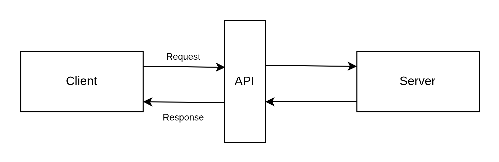
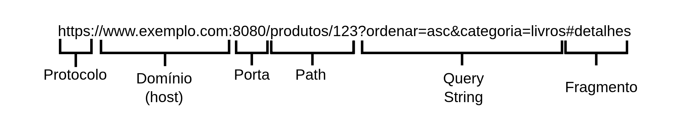

# Aula 01 

##  Introdução ao desenvolvimento web

### O que é front-end?
Parte que o usuário vê e interage diretamente (ex: páginas HTML, botões, formulários).

Responsável por:

* Interface visual

* Experiência do usuário (UX)

* Comunicação com APIs (back-end)

### O que é back-end?
Parte que roda no servidor, "por trás dos panos".

Responsável por:

* Lógica de negócio

* Acesso a banco de dados

* Segurança e autenticação

* Gerar respostas para o front

### Fluxo básico de uma requisição web
1️⃣ Usuário acessa um site (por exemplo, clicar num botão "Ver produtos").

2️⃣ Front envia uma request HTTP para o servidor.

3️⃣ O servidor (back-end) processa e devolve uma response HTTP.

4️⃣ Front exibe as informações (ex: lista de produtos).

<div align="center">
  
</div>


### O que é uma request?
Pedido enviado pelo cliente (navegador ou app) para o servidor.

Contém:

* Método HTTP (GET, POST, PUT, DELETE)

* URL

* Cabeçalhos (headers): informações extras (ex: tipo de conteúdo, autorização)

* Body (em alguns métodos): dados enviados (ex: cadastro de usuário)

#### Métodos HTTP:

* GET: pede alguma informação.

* POST: envia nova informação.

* PUT: atualiza informação existente.

* DELETE: remove informação.

Exemplo de request:

```
POST /api/usuarios HTTP/1.1
Host: api.exemplo.com
Content-Type: application/json
Authorization: Bearer abcdef12345
User-Agent: PostmanRuntime/7.32.3
Accept: application/json
Content-Length: 74
Body (payload):
{
  "nome": "Maria Silva",
  "email": "maria@exemplo.com",
  "senha": "123456"
}
```


### URL – O Endereço Digital
URL significa Uniform Resource Locator, ou Localizador Uniforme de Recursos é o endereço completo que usamos para acessar algum recurso na internet, como uma página web, uma API ou um arquivo.
A URL indica para onde a request deve ir e o que está pedido. 

Exemplo de URL:

<div align="center">
  
</div>


### O que é uma response?
Resposta do servidor para o cliente.

Contém:

* Status code (ex: 200 OK, 404 Not Found, 500 Internal Server Error)

* Headers (informações sobre resposta)

* Body (conteúdo retornado, ex: JSON com dados)

Códigos de Status HTTP 

* 200 OK: tudo correu bem.

* 201 Created: algo novo foi criado.

* 400 Bad Request: ops, algo deu errado na sua solicitação.

* 404 Not Found: o que você queria não está lá.

* 500 Internal Server Error: algo deu errado no lado do outro programa.

Exemplo de response:

```
HTTP/1.1 201 Created
Content-Type: application/json
Location: /api/usuarios/10
Date: Sat, 29 Jun 2025 18:00:00 GMT

Body:
{
  "id": 10,
  "nome": "Maria Silva",
  "email": "maria@exemplo.com",
  "criadoEm": "2025-06-29T18:00:00Z"
}
```


### O que é uma API?

API (Application Programming Interface), ou Interface de Programação de Aplicações, é uma interface que permite que um sistema converse com outro. É um *meio de comunicação* entre sistemas ou partes de um software.

APIs web geralmente seguem estilo REST.

Exemplo do dia a dia:

Um app de delivery consulta uma API para mostrar os restaurantes disponíveis.

Você clica → o app envia request → API responde com lista de pratos.

#### Benefícios das APIs
* Permitem integrar sistemas diferentes.

* Separação clara entre front-end e back-end.

* Reutilização: o mesmo back-end pode atender diferentes front-ends (web, mobile, etc.).

#### Exemplos famosos de APIs
* API do Google Maps (mostrar mapas em apps)

* API do Twitter (postar ou ler tweets)

* API de pagamento (ex: Stripe, PayPal)