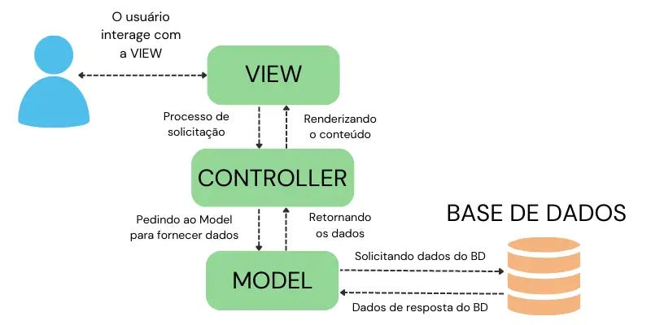

# Aula 02

## Arquitetura MVC e primeiras implementações

Arquitetura MVC é um padrão de arquitetura de software que divide a aplicação em três camadas: model (responsável epla manipulação dos dados), view (responsável pela interação do usuário) e  controller (camada de controle).

A comunicação entre a view e model é definida através de um controlador, que separa as camadas. Quando um evento é executado na interface gráfica, como um clique em um botão, a interface se comunicará com o controlador, que por sua vez se comunica com as regras de negócios.

De maneira resumida, a camada:

* **Model** é a camada que representa os dados e regras de negócio.

* **View** é responsável pela apresentação da interface do usuário. Ela exibe informações ao usuário e recebe entrada.

* **Controller** é a camada intermediário entre Model e a View que gerencia requisições e coordena fluxo entre Model e View.

  

fonte: Medium, OiArquitetura MVC e princípios de projeto, 2024

### Benefícios do padrão MVC:

* Separação de responsabilidades.

* Facilita manutenção e testes.

* Código organizado e modular.

## Exploração da estrutura no Spring

* Controllers → `@RestController`

* Models (ou Entities) → classes que representam dados -> `@Entity`

* Services → camada intermediária onde é implementada a lógica de negócio 

* Repositories → camada de acesso ao banco de dados

## Criando elementos da camada Model, Controller e View.
