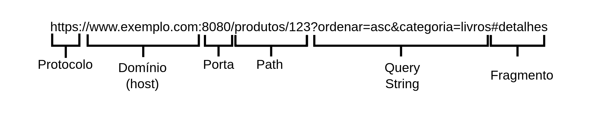

#  Introdução ao desenvolvimento web

## O que é front-end?
Parte que o usuário vê e interage diretamente (ex: páginas HTML, botões, formulários).

Responsável por:

* Interface visual

* Experiência do usuário (UX)

* Comunicação com APIs (back-end)


## O que é back-end?
Parte que roda no servidor, "por trás dos panos".

Responsável por:

* Lógica de negócio

* Acesso a banco de dados

* Segurança e autenticação

* Gerar respostas para o front

## Fluxo básico de uma requisição web
1️⃣ Usuário acessa um site (por exemplo, clicar num botão "Ver produtos").

2️⃣ Front envia uma request HTTP para o servidor.

3️⃣ O servidor (back-end) processa e devolve uma response HTTP.

4️⃣ Front exibe as informações (ex: lista de produtos).

<div align="center">
  
</div>


### O que é HTTP?

HTTP significa HyperText Transfer Protocol (Protocolo de Transferência de Hipertexto). É o protocolo padrão usado para comunicação entre clientes (como navegador ou um app) e servidores web.

#### Como funciona?
Quando você digita uma URL no navegador, por exemplo:

    http://www.exemplo.com
  
Seu navegador faz uma *request HTTP* para o servidor.
O servidor devolve uma *response HTTP* (por exemplo, a página HTML).

#### Características do HTTP
* Stateless: cada requisição é independente. O servidor não guarda "memória" das requisições anteriores.

* Baseado em texto: fácil de ler (você consegue ver headers, body etc.).

* Usa verbos: GET, POST, PUT, DELETE etc.

#### Métodos HTTP:

* **GET**: recupera um recurso

* **POST**: cria um recurso
* **PATCH**: atualizar parcialmente o recurso
* **PUT**: atualiza o recurso existente.
* **DELETE**: remove o recurso.

## HTTPS
* HTTPS significa HyperText Transfer Protocol Secure.

* É basicamente HTTP + segurança (SSL/TLS).

* Criptografa os dados trocados (ex: senhas, informações pessoais).

* Verifica autenticidade do servidor (certificado digital).

* Garante integridade (ninguém pode alterar os dados no caminho).


| **HTTP**                                  | **HTTPS**                                                            |
| ----------------------------------------- | -------------------------------------------------------------------- |
| Sem criptografia.                         | Com criptografia (SSL/TLS).                                          |
| Dados podem ser interceptados.            | Dados são protegidos contra interceptação e alteração.               |
| Usado em sites sem informações sensíveis. | Recomendado (ou obrigatório) para login, pagamentos, dados pessoais. |


## URL – O Endereço Digital
URL significa Uniform Resource Locator, ou Localizador Uniforme de Recursos é o endereço completo que usamos para acessar algum recurso na internet, como uma página web, uma API ou um arquivo.
A URL indica para onde a request deve ir e o que está pedido. 

Exemplo de URL:

<div align="center">
  
</div>


## Endpoints na Web: URLs e Recursos
Um endpoint é geralmente uma URL específica que aponta para um recurso no seu servidor. Quando seu navegador (o cliente) faz uma requisição HTTP, ele a envia para um endpoint.

Exemplos Práticos:

* https://api.meusite.com/usuarios: Este pode ser um endpoint que, quando acessado, retorna uma lista de todos os usuários cadastrados no sistema.

* https://api.meusite.com/usuarios/123: Este endpoint pode retornar os detalhes do usuário com ID 123.

* https://api.meusite.com/produtos/criar: Este endpoint pode ser usado para enviar dados para o servidor e criar um novo produto.

Importância do Endpoimt:

* **Organização e Clareza**: Eles ajudam a organizar a API do seu sistema, deixando claro quais operações podem ser realizadas e em quais recursos.

* **Comunicação entre Sistemas**: Endpoints são a espinha dorsal da comunicação em APIs (Application Programming Interfaces). Eles permitem que diferentes softwares "conversem" entre si. Por exemplo, o aplicativo do seu banco no celular usa vários endpoints para exibir seu saldo, extrato e fazer pagamentos.

* **Separação de Responsabilidades**: Cada endpoint geralmente tem uma responsabilidade bem definida (por exemplo, buscar usuários, criar um pedido, atualizar um produto).

* **Desenvolvimento Orientado a Recursos**: No desenvolvimento web moderno, especialmente com APIs RESTful, os endpoints são projetados em torno de "recursos" (como usuários, produtos, pedidos), tornando a API mais intuitiva e padronizada.

## O que é request?
Pedido enviado pelo cliente (navegador ou app) para o servidor.

Contém:

* Método HTTP (GET, POST, PUT, DELETE)

* URL

* Cabeçalhos (headers): informações extras (ex: tipo de conteúdo, autorização)

* Body (em alguns métodos): dados enviados (ex: cadastro de usuário)


Exemplo de request:

```
POST /api/usuarios HTTP/1.1
Host: api.exemplo.com
Content-Type: application/json
Authorization: Bearer abcdef12345
User-Agent: PostmanRuntime/7.32.3
Accept: application/json
Content-Length: 74
Body (payload):
{
  "nome": "Maria Silva",
  "email": "maria@exemplo.com",
  "senha": "123456"
}
```

## O que é response?
Resposta do servidor para o cliente.

Contém:

* Status code (ex: 200 OK, 404 Not Found, 500 Internal Server Error)

* Headers (informações sobre resposta)

* Body (conteúdo retornado, ex: JSON com dados)

Códigos de Status HTTP 

* 200 OK: tudo correu bem.

* 201 Created: algo novo foi criado.

* 400 Bad Request: ops, algo deu errado na sua solicitação.

* 404 Not Found: o que você queria não está lá.

* 500 Internal Server Error: algo deu errado no lado do outro programa.

Exemplo de response:

```
HTTP/1.1 201 Created
Content-Type: application/json
Location: /api/usuarios/10
Date: Sat, 29 Jun 2025 18:00:00 GMT

Body:
{
  "id": 10,
  "nome": "Maria Silva",
  "email": "maria@exemplo.com",
  "criadoEm": "2025-06-29T18:00:00Z"
}
```

### Alguns formatos de retorno do response

* **HTML** : Quando você acessa uma página web tradicional no navegador, o servidor devolve um documento HTML completo que será renderizado na tela.
* **JSON** :  JavaScript Object Notation (JSON) é um formato de texto leve e legível por humanos e máquinas, muito utilizado para trocar dados entre o cliente e o servidor. Os dados são estruturados em chave-valor. Exemplo:

```json
{
  "id": 1,
  "nome": "Camisa",
  "preco": 79.9
}
```
* **XML**: Muito usado antigamente, ou em integrações legadas (ex: SOAP). Os dados são estruturado em tags. Exemplo:

```xml
<produto>
  <id>1</id>
  <nome>Camisa</nome>
  <preco>79.9</preco>
</produto>
```

⚖️ O que determina o formato do response? O tipo de conteúdo (Content-Type) especificado no header do response.

Exemplos:

`Content-Type: application/json`

`Content-Type: text/html`

`Content-Type: application/pdf`

`Content-Type: image/png`


## O que é uma API?

API (Application Programming Interface), ou Interface de Programação de Aplicações, é uma interface que permite que um sistema converse com outro. É um *meio de comunicação* entre sistemas ou partes de um software.

APIs web geralmente seguem estilo REST.

Exemplo do dia a dia:

Um app de delivery consulta uma API para mostrar os restaurantes disponíveis.

Você clica → o app envia request → API responde com lista de pratos.

### Benefícios das APIs
* Permitem integrar sistemas diferentes.

* Separação clara entre front-end e back-end.

* Reutilização: o mesmo back-end pode atender diferentes front-ends (web, mobile, etc.).

### Exemplos famosos de APIs
* [The movie database](https://developer.themoviedb.org/docs/getting-started)

 Buscar livros por palavra-chave

**GET** https://api.themoviedb.org/3/search/movie?api_key=8af0020b2964b97740da52dcd4438fab&query=inception

Busca todos os filmes que contêm “inception” no título ou descrição.

Listar filmes mais populares:

**GET** https://api.themoviedb.org/3/movie/popular?api_key=8af0020b2964b97740da52dcd4438fab&page=1

* [Reqres](https://reqres.in/)

## API REST

API REST (Representational State Transfer) é um estilo arquitetural para construir APIs que utiliza métodos HTTP para interagir com recursos, permitindo que sistemas se comuniquem de forma flexível e escalável na web.  É um conjunto de diretrizes que define como construir APIs web de maneira padronizada, facilitando a troca de dados e a interação entre diferentes aplicações. 

### Características principais de uma API REST

* Utiliza os verbos HTTP
* Stateless (sem estado): cada requisição enviada do cliente para o servidor deve conter todas as informações necessárias para ser processada. O servidor não armazena informações sobre o estado do cliente entre as requisições.

* Uso de URLs claras e recursos: cada "coisa" que queremos acessar ou manipular (ex.: usuários, produtos, pedidos) é representada por uma URL (endpoint).

Exemplo: 
```
GET /api/usuarios — lista todos os usuários
GET /api/usuarios/5 — busca o usuário com ID 5
POST /api/usuarios — cria um novo usuário
```

* Respostas em formatos padronizados: normalmente, as APIs REST retornam dados no formato JSON (JavaScript Object Notation).

* Desacoplamento cliente-servidor: O cliente (ex.: um app ou frontend web) e o servidor (API) são independentes. O cliente apenas consome os dados expostos pela API.

* Possibilidade de armazenamento em cache

### Por que REST?
* Simples e usa HTTP (amplamente suportado).

* Escalável.

* Flexível (qualquer linguagem ou tecnologia pode consumir).